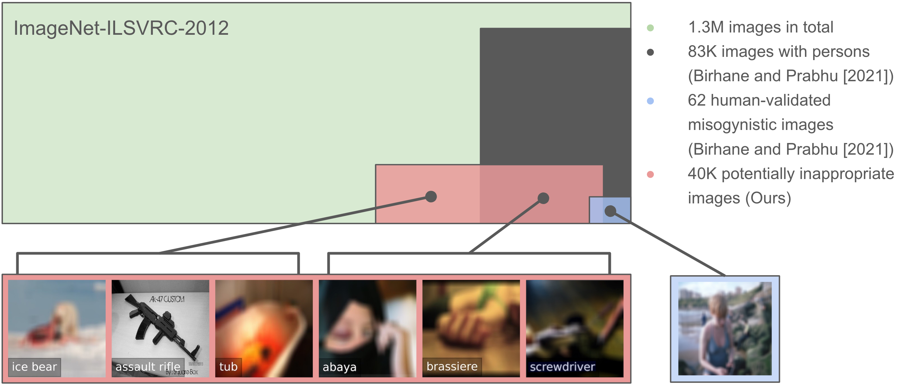

# Can Machines Help Us Answering Question 16 in Datasheets, and In Turn Reflecting on Inappropriate Content?

FAccT 2022 paper: https://dl.acm.org/doi/10.1145/3531146.3533192

> **Can Machines Help Us Answering Question 16 in Datasheets, and In Turn Reflecting on Inappropriate Content?**
>
> Patrick Schramowski, Christopher Tauchmann, Kristian Kersting
>
> Abstract: Large datasets underlying much of current machine learning raise serious issues concerning inappropriate content such as offensive, insulting, threatening, or might otherwise cause anxiety. 
This calls for increased dataset documentation, e.g., using datasheets. They, among other topics, encourage to reflect on the composition of the datasets. So far, this documentation, however, is done manually and therefore can be tedious and error-prone, especially for large image datasets.
Here we ask the arguably "circular" question of whether a machine can help us reflect on inappropriate content, answering Question 16 in Datasheets.
To this end, we propose to use the information stored in pre-trained transformer models to assist us in the documentation process.
Specifically, prompt-tuning based on a dataset of socio-moral values steers CLIP to identify potentially inappropriate content, therefore reducing human labor. We then document the inappropriate images found using word clouds, based on captions generated using a vision-language model.
The documentations of two popular, large-scale computer vision datasets---ImageNet and OpenImages---produced this way suggest that machines can indeed help dataset creators to answer Question 16 on inappropriate image content.

<a href="https://arxiv.org/abs/2202.06675"></a>
<a href="https://opensource.org/licenses/MIT"></a>
<a href="https://colab.research.google.com/drive/1_JoaTV-E83ejcjcT4FlMG0_lg_8YODPZ?usp=sharing"></a>



## Getting Started

You can find a simple example on how to use the inappropriate content detector here: [Colab](https://colab.research.google.com/drive/1_JoaTV-E83ejcjcT4FlMG0_lg_8YODPZ?usp=sharing)
### Installation
1. Create a virtual environment and install required packages via: 
```
pip install requirements.txt
```
2. For the image description generation clone the repo *https://github.com/Aleph-Alpha/magma* and follow the installation instructions.

3. In /data we provide the learned model parameters (prompts.p) for three different CLIP variants. By default the largest, more recently released, variant is used (ViT-L/14). To reproduce the paper results please use ViT-B/16. 
### Image classification

- To classify inappropriate image content run
```
python main/clip_classifier/classify/inference_images.py --input_folder <path/to/images> --output_folder <path/output>
```
The script will search for files with the following suffix and directory structure: '/&ast;.JPEG', '/&ast;.png', '/&ast;.jpg', '/&ast;/&ast;.JPEG', '/&ast;/&ast;.png', '/&ast;/&ast;.jpg'. If you need other data types you can apply changes on the *find_images* method located in *main/paper_experiments/experiments.py*.

- If you already computed the CLIP embeddings you can use the package *embedding-reader* (https://github.com/rom1504/embedding-reader) via 
```
pip install embedding_reader
```
and run

```
python main/clip_classifier/classify/inference_embeddings.py --input_folder <path/to/images> --output_folder <path/output>
```

### Content documentation
1. Caption generation
An example on how to generate image captions is provided in *main/caption_generation/magma_inference.py* . 
This requires the repo *https://github.com/Aleph-Alpha/magma* (see Installation section)
For the wordcloud generation save the caption image pairs as csv with "\t" as seperator: <image_id> \t <caption>

2. Wordcloud generation
Script to generate wordclouds are contained in *main/wordclouds*.
 
- Wordclouds based on dataset annotations:
    - add your dataset to line 31 in *main/wordclouds/wc_dataset_annotations.py*
    - run:
```
python main/wordclouds/wc_dataset_annotations.py --dataset <name_of_your_dataset> --dataset_path <path/to/data> --csv_path <path/to/list/inappropriate-imagesids>
```

- Wordclouds based on generated captions:
```
python main/wordclouds/wc_weighted_captions.py --load_path path/to/dir/with/text_noninapp.csv/and/text_inapp.csv
python main/wordclouds/wc_captions.py --load_path path/to/file/text_inapp.csv
```


## Reproducibility 
The results of the SMID-based evaluation as well as the imagenet and openimages documentations are included in the *data/* directory.
Generated captions for imagenet and openimages can be downloaded here https://hessenbox.tu-darmstadt.de/getlink/fiDKWESMQkVM8zCGkHyNt92r/ and need to be placed in *data/*.

Scripts to classify inapproriate content contained in the dataset imagenet and openimages are provided in *main/paper_experiments/check_datasets* and to generate the wordclouds are provided in *main/paper_experiments/compute_wordclouds*.
Further, we provide notebooks to reproduce the figures included in the paper in *main/paper_experiments/notebooks*.


## Citation
If you use this code for your research, please cite the following:
```
@inproceedings{schramowski2022can,
  title={Can Machines Help Us Answering Question 16 in Datasheets, and In Turn Reflecting on Inappropriate Content?},
  author={Patrick Schramowski and Christopher Tauchmann and Kristian Kersting},
  booktitle = {Proceedings of the ACM Conference on Fairness, Accountability, and Transparency (FAccT)},
  year={2022}
}
```

### TODOS
- train and validate on smid
